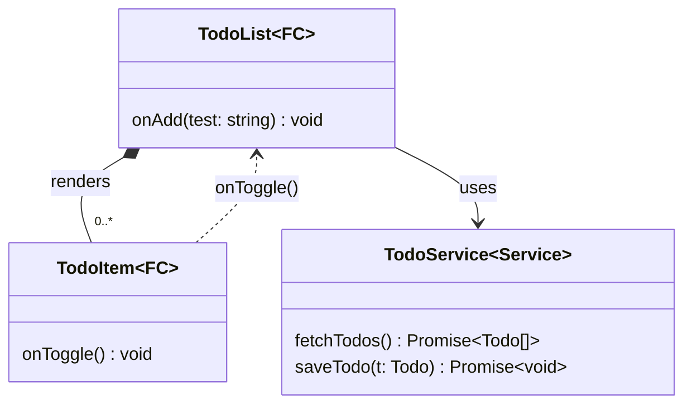

TodoService Class Diagram

```mermaid
classDiagram
    class TodoService~Service~ {
        fetchTodos() Promise~Todo[]~
        saveTodo(t: Todo) Promise~void~
    }

    class TodoList ~FC~ {
        onAdd(test: string) void
    }

    class TodoItem ~FC~ {
        onToggle() void
    }

    TodoList *-- "0..*" TodoItem: renders
    TodoList --> TodoService: uses
    TodoItem ..> TodoList: onToggle()
```
