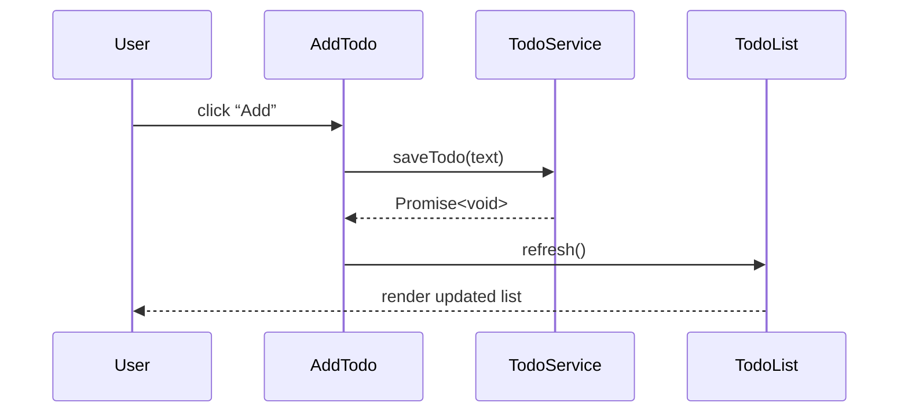

```mermaid
sequenceDiagram
  participant U as User
  participant C as AddTodo
  participant S as TodoService
  participant L as TodoList

  U->>C: click “Add”
  C->>S: saveTodo(text)
  S-->>C: Promise<void>
  C->>L: refresh()
  L-->>U: render updated list
```
