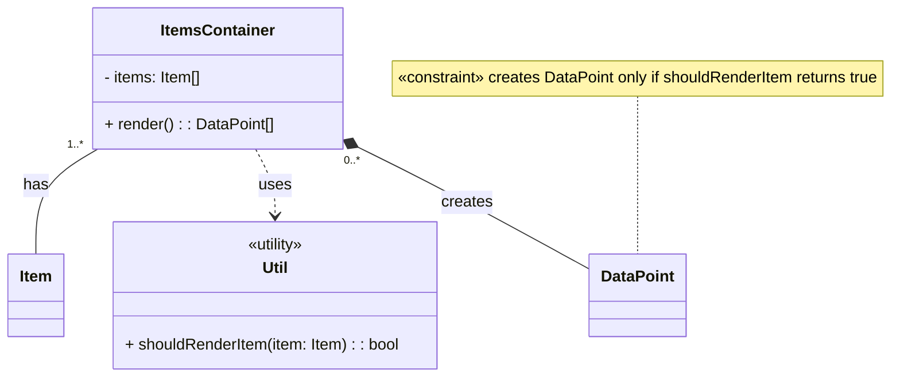
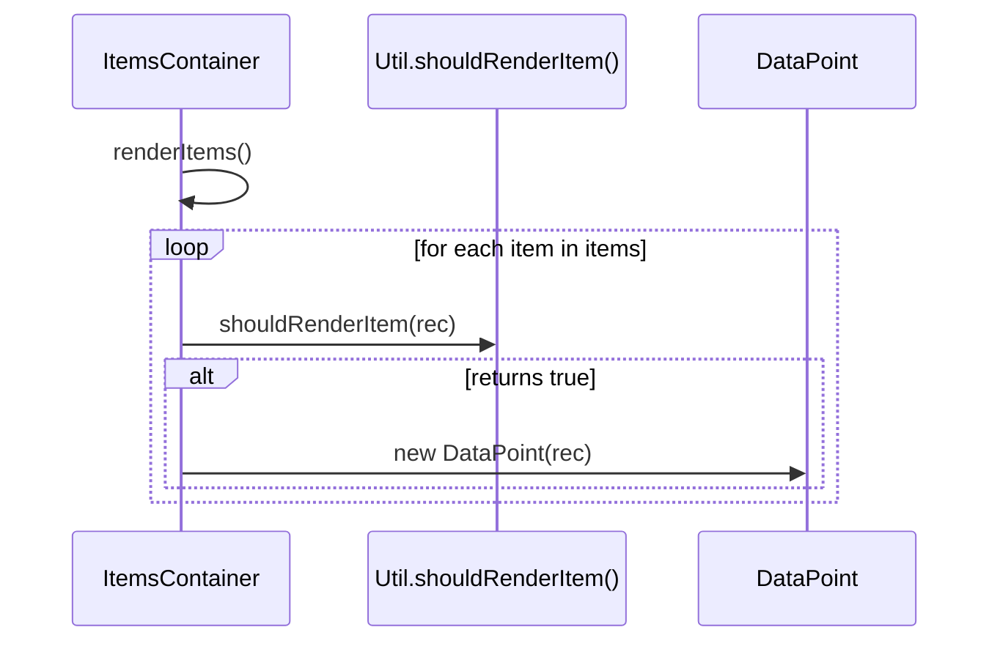

### Code Example

```tsx
import type { Item } from "./types";

import { DataPoint } from "./components/data-point";
import { shouldRenderItem } from "./util";

export const ItemsContainer: FC<{ items: Item[] }> = ({ items }) => {
  return items.filter(shouldRenderItem).map(() => <DataPoint {...item} />);
};
```

### Class Diagram



### Sequence Diagram


