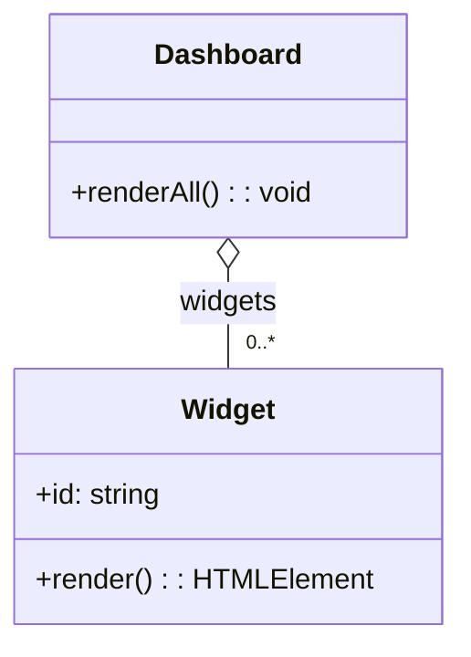

**“A has many B, but B lives independently”** – a container collects items passed in.

```ts
// widget.ts
export class Widget {
  constructor(public id: string, public render: () => HTMLElement) {}
}

// dashboard.tsx
import { Widget } from "./widget";

export class Dashboard {
  constructor(private widgets: Widget[]) {}

  renderAll() {
    this.widgets.forEach(w => document.body.appendChild(w.render()));
  }
}

// usage
const w1 = new Widget("news", () => /*…*/);
const w2 = new Widget("stats", () => /*…*/);
new Dashboard([w1, w2]).renderAll();
```


