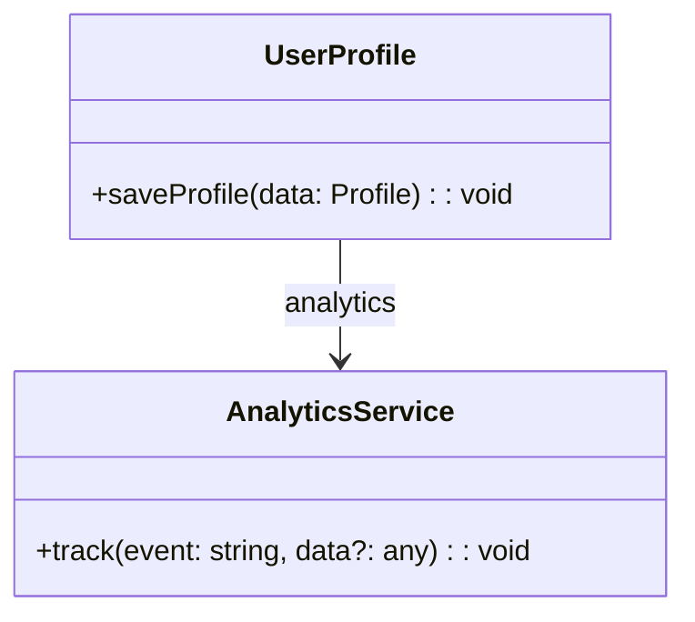

**“A knows about B”** – one class holds a reference to another service/component.

```ts
// analytics.ts
export class AnalyticsService {
  track(event: string, data?: any) {
    /* send to server */
  }
}

// user-profile.tsx
import { AnalyticsService } from "./analytics";

export class UserProfile {
  constructor(private analytics: AnalyticsService) {}

  saveProfile(data: Profile) {
    this.analytics.track("profile:save", data);
    // …persist…
  }
}

// wiring
const analytics = new AnalyticsService();
const profile = new UserProfile(analytics);
```


