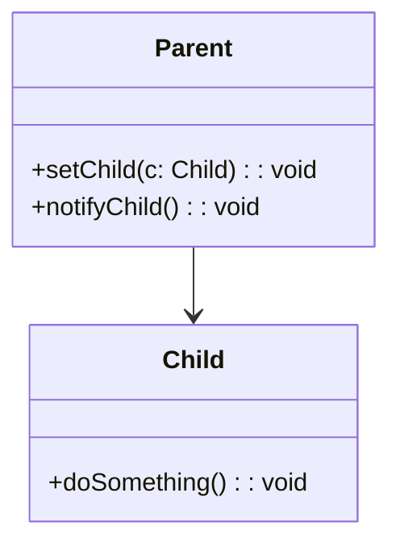
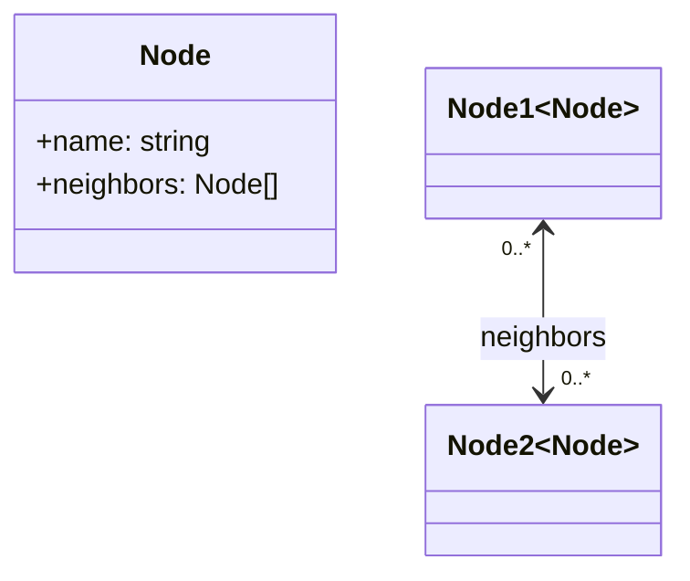

- Directed (A → B): only A holds B.

```ts
import { Child } from "./child";

export class Parent {
  private child!: Child;
  setChild(c: Child) {
    this.child = c;
  }
  notifyChild() {
    this.child.doSomething();
  }
}
```



- Bidirectional (A ↔ B): each holds a reference to the other

```ts
// node.ts
export class Node {
  constructor(public name: string) {}
  neighbors: Node[] = [];
}

// usage
const a = new Node("A");
const b = new Node("B");
a.neighbors.push(b);
b.neighbors.push(a);
```


