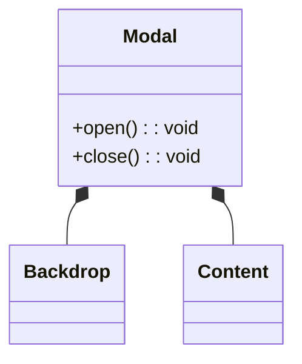

**A composes B and owns its lifecycle** – A creates/destroys its parts.

```tsx
// modal.tsx
class Backdrop {
  /* … */
}
class Content {
  /* … */
}

export class Modal {
  private backdrop = new Backdrop();
  private content = new Content();

  open() {
    document.body.append(this.backdrop.element, this.content.element);
  }
  close() {
    this.backdrop.element.remove();
    this.content.element.remove();
  }
}
```


