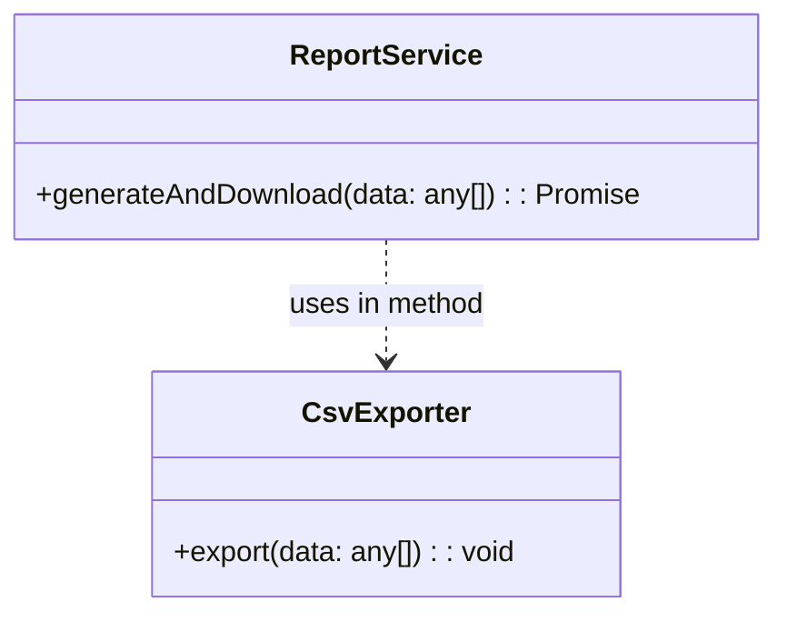

**A depends on B only within one method** – temporary, method-scoped use.

```ts
// csv-exporter.ts
export class CsvExporter {
  export(data: any[]) {
    /* build & download CSV */
  }
}

// report.ts
import { CsvExporter } from "./csv-exporter";

export class ReportService {
  async generateAndDownload(data: any[]) {
    // only here: no field, no constructor
    new CsvExporter().export(data);
  }
}
```


