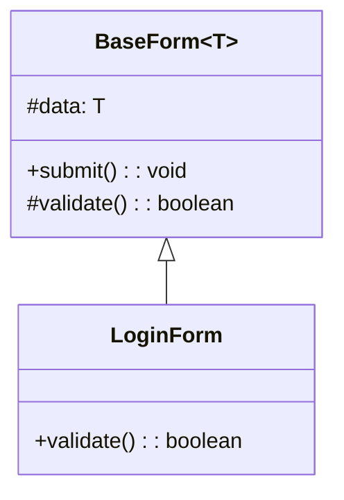

**B extends A** – share common behavior via a base class.

```ts
export abstract class BaseForm<T> {
  protected data!: T;
  abstract validate(): boolean;
  submit() {
    if (this.validate()) {
      /* send this.data */
    }
  }
}

// login-form.tsx
import { BaseForm } from "./base-form";

export class LoginForm extends BaseForm<{ user: string; pass: string }> {
  validate() {
    return !!this.data.user && !!this.data.pass;
  }
}
```


