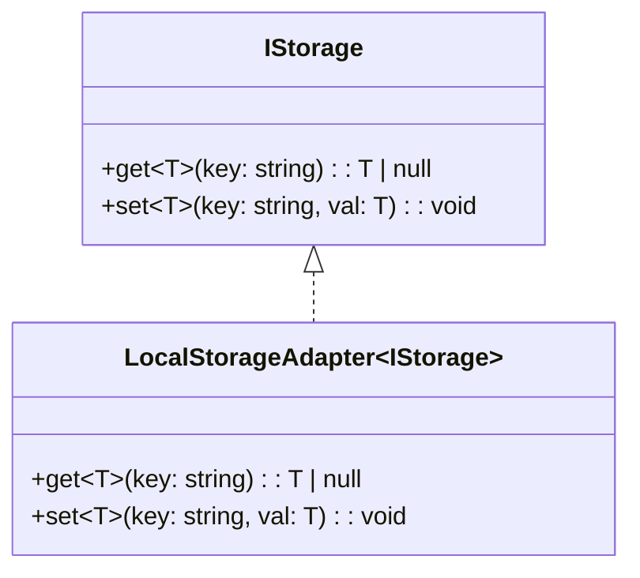

**C implements I** – promise to fulfill an interface contract.

```ts
// storage.ts
export interface IStorage {
  get<T>(key: string): T | null;
  set<T>(key: string, val: T): void;
}

// local-storage.ts
import { IStorage } from "./storage";

export class LocalStorageAdapter implements IStorage {
  get<T>(k: string) {
    return JSON.parse(localStorage.getItem(k) || "null");
  }
  set<T>(k: string, v: T) {
    localStorage.setItem(k, JSON.stringify(v));
  }
}
```


